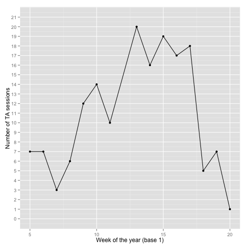

```
## Loading required package: knitr
```


## Intro

This is a quick report on the number of sessions (each 30 min long) with 2014 MPH capstone project TAs. Reservations are made using http://glimmer.rstudio.com/lcolladotor/MPHcapstoneTA/ and can be cancelled with up to 24hrs notice. They can only be made up to a week before the actual meeting day. Furthermore, a student can only have one __active__ reservation at a time. That is, a reservation for any session on the following 7 days. Finally, each TA offers 8 slots per week for students to sign up and the TA schedule is available under the __TA info__ tab on the [site](http://glimmer.rstudio.com/lcolladotor/MPHcapstoneTA/). It is also dynamically changed when a student selects a day of the week in the [site](http://glimmer.rstudio.com/lcolladotor/MPHcapstoneTA/) thus allowing the student to choose among the TAs that have sessions on the day the student is free.


## By day of the year

The following figure shows the number of TA sessions per TA per day of the year. Note that the term officially started on January 21st (week 4 of the year) but there were no TA sessions that week. There are a couple of outliers, but most TAs had 1 or 2 sessions per day (if any).

 

## By TA and week number

Because each TA offers sessions during different weekdays, we can also look at the data per week of the year as shown below. TA __C__ had 4 full weeks with 8 slots used out of the 8 available. If you are a student, remember that there are plenty of other highly capable TAs available! It could also be that TA __C__ chose the hours that are the most convenient for students. TA __F__ has was quite busy as well followed by TA __B__.

 

## By day of the week

We can also explore the data to check which day of the week is has been the most busy so far. The next figure shows the number of TA sessions broken up by weekday. Wednesday and Monday were the most popular options.

 

## By week

Finally, we can check if the overall number of TA sessions has changed as the term has progressed. We can see that weeks 13 to 17 were the most intense ones.


 


## References

Web document generated using `slidify` (<span class="showtooltip" title="Vaidyanathan R (2012). slidify: Generate reproducible html5 slides from R markdown. R package version 0.4.  </p>"><a href="http://ramnathv.github.com/slidify/">Vaidyanathan, 2012</a></span>). Citations made with `knitcitations` (<span class="showtooltip" title="Boettiger C (2014). knitcitations: Citations for knitr markdown files. R package version 0.5-0.  </p>"><a href="http://CRAN.R-project.org/package=knitcitations">Boettiger, 2014</a></span>). 


- Carl Boettiger,   (2014) knitcitations: Citations for knitr markdown files.  [http://CRAN.R-project.org/package=knitcitations](http://CRAN.R-project.org/package=knitcitations)
- Ramnath Vaidyanathan,   (2012) slidify: Generate reproducible html5 slides from R markdown.  [http://ramnathv.github.com/slidify/](http://ramnathv.github.com/slidify/)


## R code


```r
## Load required libraries
library("ggplot2")
suppressMessages(library("dplyr"))

## Load and clean data
load("reservations.Rdata")
data <- reservations[complete.cases(reservations$TA), 
    ]
data <- subset(data, Student != "Calendar fix" & !Description %in% 
    c("Therri will not hold office hours this day.", 
        "Leo will not hold office hours this day.", 
        "Meeting with department chair", "not available at this time today", 
        "Therri will not hold office hours at this time.", 
        "Will not be available to meet with students on Monday at this time.", 
        "Leo will be out of town"))

## Anonymize TAs
data$TA <- factor(data$TA)
levels(data$TA) <- toupper(letters[1:6])

## Get the day of the actual TA sessions
data$dDay <- as.Date(data$desiredDate, format = "%d-%m-%Y")

## Summarise the data to get the number of sessions
## per day on a given day
sum <- summarise(group_by(data[, -c(8, 11, 12)], dDay, 
    TA), number = n())
## Calculate the week number (base 1). Used
## http://stackoverflow.com/questions/15278128/calculate-the-week-number-0-53-in-year-with-r
sum$weeknum <- as.numeric(format(sum$dDay + 6, "%U"))
## Plot by day of the year
ggplot(sum, aes(x = dDay, y = number, fill = TA)) + 
    geom_bar(stat = "identity", position = "dodge") + 
    xlab("Day of the year") + ylab("Number of TA sessions")

## Plot by week of the year
sum <- regroup(sum, list(quote(weeknum)))
tabyweek <- summarise(group_by(sum, weeknum, TA), number = sum(number))
ggplot(tabyweek, aes(x = weeknum, y = number, fill = TA)) + 
    geom_bar(stat = "identity", position = "dodge") + 
    xlab("Week of the year (base 1)") + ylab("Number of TA sessions")

## Plot by weekday
sum$weekday <- weekdays(sum$dDay)
tmp <- regroup(sum, list(quote(weekday)))
byweekday <- summarise(tmp, number = sum(number))
byweekday$weekday <- factor(byweekday$weekday, levels = c("Monday", 
    "Tuesday", "Wednesday", "Thursday", "Friday"))
ggplot(byweekday, aes(x = weekday, y = number)) + geom_bar(stat = "identity") + 
    xlab("Day of the week") + ylab("Number of TA sessions")

## Plot by week of the year ignoring TA
byweek <- summarise(sum, number = sum(number))
ggplot(byweek, aes(x = weeknum, y = number)) + geom_point() + 
    geom_line() + xlab("Week of the year (base 1)") + 
    ylab("Number of TA sessions") + scale_y_continuous(breaks = seq(0, 
    max(byweek$number) + 1, by = 1), limits = c(0, 
    max(byweek$number) + 1))
```

## Reproducibility

This report was last updated on


```
## [1] "2014-05-24 10:40:28 EDT"
```

R session information:


```
## R version 3.1.0 (2014-04-10)
## Platform: x86_64-apple-darwin10.8.0 (64-bit)
## 
## locale:
## [1] en_US.UTF-8/en_US.UTF-8/en_US.UTF-8/C/en_US.UTF-8/en_US.UTF-8
## 
## attached base packages:
## [1] stats     graphics  grDevices utils     datasets  methods   base     
## 
## other attached packages:
## [1] knitcitations_0.5-0 bibtex_0.3-6        knitr_1.5.35       
## [4] slidify_0.4         dplyr_0.2           ggplot2_1.0.0      
## 
## loaded via a namespace (and not attached):
##  [1] assertthat_0.1   codetools_0.2-8  colorspace_1.2-4 digest_0.6.4    
##  [5] evaluate_0.5.5   formatR_0.10.4   grid_3.1.0       gtable_0.1.2    
##  [9] httr_0.3         labeling_0.2     markdown_0.7     MASS_7.3-33     
## [13] munsell_0.4.2    parallel_3.1.0   plyr_1.8.1       proto_0.3-10    
## [17] Rcpp_0.11.1      RCurl_1.95-4.1   reshape2_1.4     scales_0.2.4    
## [21] stringr_0.6.2    tools_3.1.0      whisker_0.3-2    XML_3.98-1.1    
## [25] xtable_1.7-3     yaml_2.1.11
```

Generate report:


```r
library("slidify")
system("rm -fr .cache")
slidify("index.Rmd")
```


<div id='disqus_thread'></div>


